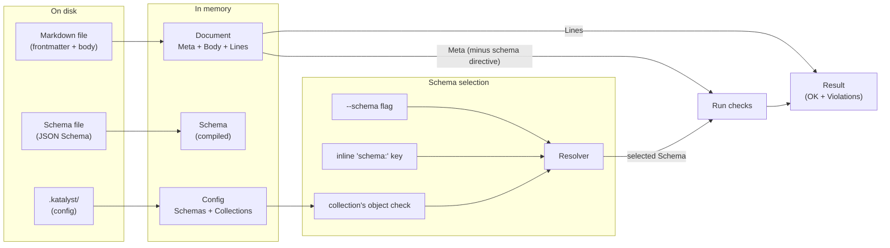

+++
title = "Domain model"
weight = 40
+++

# Domain model

What `katalyst` is *about*: the concepts it manipulates and how they relate.
This is the conceptual map and the entry point to the subsystem deep-dives -
each piece is summarized here and documented in full on its own page.

This page is the katalyst-specific map; [core concepts]()
is the same map at the general, tool-agnostic altitude (the same vocabulary
applied to a Postgres table or a MongoDB collection). For *what* the commands do,
see the [getting-started tutorial]() and the
[configuration reference]().

## At a glance

## The pieces

Each entity is summarized here; follow the link for its full treatment.

**Content and parsing** - see [Frontmatter and fix]():

- **Markdown document** - a file's frontmatter (`Meta`) plus its body, parsed
  into a `Document` with source-line tracking.

**Configuration and collections** - see [Collections]():

- **Config** - the loaded `.katalyst/` directory: which schemas exist and what
  each collection checks.
- **Collection** - a named, directory-backed group of items that owns a set of
  checks. **Item** - one file in it, addressed by a **Selector**
  (`<collection>/<item>`).
- **Schema** - a named JSON Schema describing an item's legal `Meta`. The
  **schema directive** (`schema:` in frontmatter) opts a document into a schema,
  and the **Resolver** picks the applicable one by the three-tier precedence.

**Checks and inspectors**:

- **Check** and **CheckLibrary** - a check asserts one condition; a library
  provides and runs it. The product is a **validation result**: a flat list of
  violations, or `path: OK`. See [Checks]().
- **Inspector** - the descriptive dual of a check, reporting the distribution a
  check would assert against. See [Inspectors]().

## Lifecycles

- **`check`** resolves each item's schema and check list and runs them; the
  end-to-end flow is in [Collections]().
- **`fix`** rewrites frontmatter into canonical form without touching the body -
  see [Frontmatter and fix]().

Each subsystem page lists its own invariants; the repo-wide engineering rules
(such as "production code lives in `internal/`") are in the root `AGENTS.md`.

## Vocabulary

The canonical definitions of frontmatter, metadata, schema, collection, item,
selector, check, and the rest live in the
[glossary](). Use those terms
consistently in code, docs, and user-facing copy.

## Out of scope (today)

Absences worth being explicit about; they shape what katalyst currently is
*not*:

- **Relations between items.** A schema constrains one item at a time; no
  cross-item `$ref`, no foreign keys. Planned.
- **Schema evolution.** No "this field was renamed in v2" migrations. Planned.
- **Query.** Katalyst has `item list` filters and sort keys for one collection,
  implemented as an in-memory listing pipeline. A first-class storage query
  operation, "find all docs where year > 1980" pushed into the backend, is
  planned.
- **Derived state.** `.katalyst/` holds only hand-authored config; nothing is
  generated into it. Every run is stateless.
