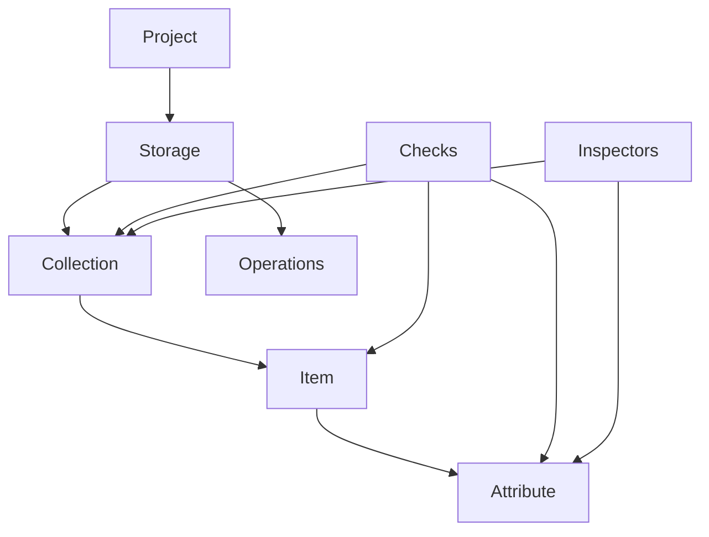

+++
title = "Domain model"
weight = 30
bookCollapseSection = true
+++

# Domain model

Katalyst reasons in a small vocabulary that is general enough to describe a
Postgres table, a directory of markdown files, a MongoDB collection, and a
hosted API response the same way. That shared vocabulary is what lets checks,
inspectors, selectors, and future backends fit the same model instead of
becoming one-off adapters.

This page introduces the concepts and how they fit. Each term's canonical
definition lives in the [glossary]().

## The concepts

- A **project** is the whole workspace katalyst operates over: a configured
  root that binds one or more storage backends into named collections. Its
  configuration is the **config**; in katalyst today, that config is the
  `.katalyst/` directory. An empty selector addresses the whole project.
- **Storage** is a backend that holds data: a filesystem, a SQLite database, a
  Postgres instance, an S3 bucket, or another store. Katalyst's implementation
  is the [storage layer](), where a storage instance
  maps backend-native references into the domain model.
- A **collection** is a group of items that share structure: a directory of
  similar files, a relational table, a Mongo collection, or a family of API
  resources. Collections are the unit that owns checks and that users address
  by name. See [Collections]().
- An **item** is one unit of data in a collection: a markdown file, a table row,
  a Mongo document, or one API resource.
- An **attribute** is a named characteristic of an item: a column, a
  frontmatter key, a response field, its filename, its path, or another
  backend-derived property. A key in a structured object specifically is a
  **field**.
- An **operation** is something a backend lets you do with data: read, list,
  aggregate, write, and eventually query. Which operations a backend supports,
  and what structural commitments those operations require, is the subject of
  [progressive operations]().
- A **check** asserts a condition on an item, an attribute, or a whole
  collection and reports a violation when the condition fails. See
  [Checks]().
- An **inspector** is the descriptive dual of a check: it measures a
  distribution and returns evidence, never a verdict. See
  [Inspectors]().

## How the concepts fit

The hierarchy is intentionally small:

Storage locates data, collections group it, items are the units commands act
on, and attributes are the named things checks and inspectors can read.
Operations describe what the backend can do with those units. Checks and
inspectors sit on top: checks enforce a rule; inspectors measure the same
surface without enforcing anything.

That separation is why katalyst can start with markdown files but leave room
for richer stores. The check engine does not need to know whether an item came
from a file or a row if the storage layer can present the item, its attributes,
and the operations available on them.

## The workflow

The concepts also explain Katalyst's intended loop:

1. **Catalog** a source with inspectors. Start from evidence: what files,
   fields, headings, paths, and recurring shapes actually exist?
2. **Define** collections, schemas, and checks. Turn the discovered structure
   into a project config that names the collections and their expected shape.
3. **Enforce** the rules with checks. Run the same assertions locally, in CI,
   or through an agent workflow.
4. **Reshape** the content as the project changes. Use fixes, migrations, and
   storage-aware operations to keep the data aligned with the model.

The important boundary is between evidence and enforcement. Inspectors report
that 94% of items have a field; they do not decide that the field is required.
That threshold belongs in a check, chosen by a human or an agent using the
evidence.

## The same vocabulary across backends

| System               | Storage       | Collection      | Item       | Attribute        |
|----------------------|---------------|-----------------|------------|------------------|
| Postgres             | The database  | A table         | A row      | A column         |
| MongoDB              | The database  | A collection    | A document | A field          |
| A directory of CSVs  | The directory | A CSV file      | A row      | A column         |
| A REST API           | The API       | A resource type | A resource | A response field |
| An S3 bucket of JSON | The bucket    | A key prefix    | An object  | A JSON key       |

An operation defined once in this vocabulary, such as checking an attribute or
aggregating over a collection, applies to every backend that can support it.
The backend still decides the mechanics: a filesystem may list files and parse
frontmatter in memory, while a database may push filtering and aggregation into
queries. The domain vocabulary stays the same.

## Why this vocabulary matters

The point is not taxonomy for its own sake. The vocabulary keeps Katalyst from
hard-coding "markdown file" everywhere while still making markdown useful
today.

- **Portable checks.** `object_required_field` can mean "frontmatter key" for
  markdown, "column" for a table, or "field" for a document store.
- **Storage-aware growth.** A backend can start with read and list operations,
  then add query, aggregate, or write support as it becomes more structured.
- **Agent-friendly structure.** A project exposes the same nouns everywhere:
  collections to inspect, items to check, attributes to reason about, and
  violations to fix.

This is the through-line for the deeper pages: [storage]()
explains how backends attach to the model, [collections]()
explains how config names and routes items, [checks]()
explains enforcement, and [inspectors]()
explains evidence.
