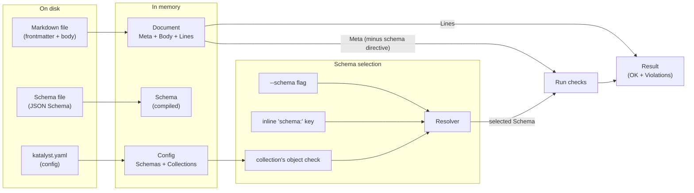

+++
title = "Domain model"
weight = 40
+++

# Domain model

What `katalyst` is *about*: the concepts it manipulates, how they relate,
and which invariants hold across the system. This is the conceptual map.

For *what* the commands do, see the [getting-started
tutorial]() and the
[configuration reference]().
For *why* specific design choices were made, see the
[configuration]() and
[formatting]() explanation pages. For *how the
code is laid out*, see the repo's `AGENTS.md` files.

## At a glance



## Entities

### Markdown document

The unit of work. A file on disk with two optional regions:

- A **frontmatter** block, fenced by `---` lines at the very top of the
  file. YAML today; TOML / JSON are planned.
- A **body**, everything after the closing fence.

A document *may* have no frontmatter, in which case `check` reports it as an
error (the file claimed no metadata, so we couldn't check anything).

When parsed, a markdown document becomes a `frontmatter.Document`:

| Field            | Meaning |
|------------------|---------|
| `HasFrontmatter` | Did the file open with `---`? |
| `Meta`           | Parsed YAML, normalized to `map[string]any` |
| `Body`           | Bytes after the closing fence, **never modified** except by `fix` |
| `Lines`          | JSON-pointer-path → 1-indexed source line |

The `Lines` index is what makes error messages locatable. It accounts for
the opening `---` fence offset, so `Lines["/title"] = 2` means the
`title:` key is on line 2 of the original file.

### Schema

A JSON Schema (draft 2020-12 by default; the library supports 4 through
2020-12) describing the legal shape of a document's `Meta`.

A schema has two identities:

- A **path** on disk, where the JSON lives.
- A **name** registered in `katalyst.yaml` (e.g. `book`, `person`). The
  name is the stable public handle used by inline `schema:` directives
  and `schema show`. Paths can change; names should not.

`--schema <path>` bypasses the name layer entirely — useful for ad-hoc
runs but skips name-based identity.

In memory, schemas are `validator.Schema`: a thin wrapper around
`santhosh-tekuri/jsonschema/v6`, kept so the rest of the codebase doesn't
depend on the library directly.

### Config

The single source of truth for "what schemas exist and what each
collection checks." Lives at `katalyst.yaml` in the **repo root**.

Discovery walks upward from the current working directory looking for
the nearest ancestor that contains the file (cf. `.git`, `.editorconfig`,
`go.mod`). The discovered directory *is* the repo root for all
subsequent path resolution.

A `config.Config` has:

| Field         | Meaning |
|---------------|---------|
| `Root`        | Absolute, symlink-resolved repo-root directory |
| `Schemas`     | Schema name → absolute file path |
| `Collections` | The named collections, in name order |

Validated at load time: every collection's object schema must reference a
known entry in `Schemas`, and a collection must configure at least one
check (via `schema:` shorthand or an explicit `checks:` list).

### Collection

A **named** group of items backed by a directory. It is the unit you select
on the command line and the unit that owns a set of checks. In
`katalyst.yaml`:

```yaml
collections:
  books:
    path: notes/books   # directory, relative to the repo root
    pattern: "*.md"      # filename glob; default "*.md"
    schema: book         # shorthand for a single object check
    checks:              # any additional checks
      - kind: markdown_title_matches_h1
```

`path` defaults to the collection name; `pattern` defaults to `*.md`. The
`schema:` shorthand is sugar for a leading `object` check. A collection
without an explicit `path` looks for a directory named after itself.

### Item

A single member of a collection: one file matching the collection's
`pattern`. Its **id** is the filename stem (`notes/books/dune.md` →
`dune`). On the command line an item is addressed by a **selector**,
`<collection>/<item>` (see below).

### Selector

How commands name what to operate on. Three shapes, from broad to narrow:

| Selector | Scope |
|---|---|
| *(none)* | the whole project — every collection |
| `<collection>` | one collection — all its items |
| `<collection>/<item>` | a single item |

Selectors are shared by `check`, `fix`, and the `item` subcommands. They are
the present-day, degenerate case of the connector
[coordinates]() idea: today an item is named by
one coordinate (its stem); richer layouts grow into more.

### Schema directive (`schema:` in frontmatter)

A per-document opt-in to a specific schema. Treated as **metadata about
katalyst itself, not user data**: the resolver reads it to choose a
schema, then strips it from `Meta` before passing to the validator. This
matters when a schema uses `additionalProperties: false` — the document
can still "name itself" without the directive becoming a validation
violation.

### Resolver

Not a persistent entity — a per-`check`-invocation object. Owns:

1. The object-schema selection policy (which schema applies to an item?).
2. A compiled-schema cache keyed by absolute path. The cache makes
   "check 10,000 files against the same schema" cost one compile.

The selection policy, highest precedence first:

| # | Source                          | When it wins |
|---|---------------------------------|--------------|
| 1 | `--schema <path>` flag          | Always, for every item in the invocation |
| 2 | Inline `schema: <name>` in FM   | When (1) absent and `Meta["schema"]` is a known name |
| 3 | The collection's object check   | When (1) and (2) absent |
| — | None                            | The item simply runs no object check |

Markdown and filesystem checks always come from the collection, regardless
of how the object schema is resolved.

### Check

A single rule run against an item — a type constraint, a heading rule, a
filename convention. Katalyst ships an **18-check engine** in three families:

- **Object** (6): `object` (full JSON Schema), plus targeted
  `object_required_field`, `object_field_type`, `object_field_enum`,
  `object_number_range`, `object_string_length`.
- **Markdown** (6): `markdown_title_matches_h1`, `markdown_requires_h1`,
  `markdown_single_h1`, `markdown_no_heading_level_jumps`,
  `markdown_required_section`, `markdown_code_fence_language_required`.
- **Filesystem** (6): `filesystem_filename_matches_slug`,
  `filesystem_extension_in`, `filesystem_filename_kebab_case`,
  `filesystem_no_spaces_in_path`, `filesystem_parent_dir_in`,
  `filesystem_filename_prefix`.

Each implements one `checks.Check` interface (`Run(Context) []Violation`)
and is documented, per kind, in the generated [rule
reference](). The per-kind
descriptors in `internal/checks/registry.go` are the source of truth for
that reference, so a new check cannot ship undocumented.

### Validation result

The product of running an item's checks. Two states:

- **Valid**: nothing to print except the conventional `path: OK`.
- **Invalid**: a flat list of violations, each with a JSON pointer `Path`
  and a `Message`. JSON Schema's raw error tree is nested and unhelpful for
  line-level reporting, so it is flattened.

When combined with `Document.Lines`, a violation becomes a
`path:line: /pointer: message` user-visible line. If the exact pointer has
no recorded line (e.g. for "missing required property" errors), the resolver
walks up to the nearest ancestor that does — pointing at the parent object
is better than pointing at nothing.

### Inspector

The descriptive dual of a check, in `internal/inspect`. A check asks "does
this item satisfy a predicate?" and returns violations; an **inspector** asks
"what is the distribution of this aspect across the corpus?" and returns
**evidence** — counts and distributions with the file count `n` as the
denominator. It realizes the `aggregate` operation from the [general
model]().

Inspectors are read-only and never recommend. They report that `status` is
present in 142 of 142 files with three distinct values; deciding that this
warrants a `required` field with an `enum` is *judgment* that belongs to
whoever reads the evidence — a human or an agent — not to the inspector. The
[`inspect`]() command parses a
directory once into a `Corpus`, runs each inspector over it, and renders the
evidence as Markdown (default) or JSON. Inspectors have their own registry and
parity test, mirroring checks, so none ships undocumented. See
[Inspectors]() for the rationale and
[the reference]() for the set.

## Lifecycle of `check`

The data flow per item, end-to-end:

1. **Load config (or take the `--schema` flag).** Discover `katalyst.yaml`
   from the working directory; failing to find one is a usage error
   (exit 2).
2. **Resolve selectors to items.** No selector means every collection; a
   `<collection>` selector means all its items; `<collection>/<item>` means
   one. Files inside a collection directory that do not match its `pattern`
   are reported as unmatched references (errors).
3. **Read file bytes.** Read errors are reported per-item but don't abort
   the run; we accumulate exit-1 status and continue.
4. **Parse frontmatter.** Errors here (malformed YAML, unterminated fence)
   are per-item failures too. No frontmatter is itself an error.
5. **Resolve the object schema** via the precedence policy above, then
   **strip the `schema:` directive** so user schemas with
   `additionalProperties: false` aren't tripped by katalyst's own metadata.
6. **Build the check list** from the resolved object check plus the
   collection's markdown/filesystem checks.
7. **Run checks.** The object check normalizes Go integer types to JSON
   `float64` before validating (yaml.v3 produces native ints; the JSON
   Schema library expects JSON-shaped numbers).
8. **Format output.** Violations get the `path:line: /pointer: message`
   treatment. Valid items print `path: OK`.

## Lifecycle of `fix`

Much simpler. For each item:

1. Read bytes.
2. Parse to `Document`.
3. If no frontmatter, return verbatim — `fix` never invents structure.
4. Marshal `Meta` with top-level keys sorted alphabetically, yaml.v3
   default block style.
5. Re-assemble: `---\n<sorted yaml>\n---\n<body>`. Body bytes are
   preserved verbatim; one trailing newline is enforced on the file.
6. Compare against the original. If unchanged, do nothing. Otherwise
   atomically rewrite (temp file + rename) — or, with `--check`, print the
   path and accumulate exit-1 status.

See [Formatting]() for why `fix` is
opinionated and why it refuses to inject missing values.

## Invariants

Properties the codebase should always uphold. Most are protected by
tests; a few are protected only by code review and convention.

1. **Body bytes are sacred.** No command except `fix` modifies them. Even
   `fix` only normalizes trailing whitespace and the leading separator;
   interior body bytes round-trip exactly.
2. **Schema names are stable; paths can move.** `katalyst.yaml` is the only
   place that knows how names map to paths.
3. **The `schema:` directive is katalyst metadata, not user data.** It
   influences resolution but never reaches the validator.
4. **A collection owns its checks; an item belongs to one collection.**
   There is no glob-ordering "first match wins" — an item's checks are the
   checks of the collection whose directory contains it.
5. **Line numbers are file-relative and 1-indexed.** The opening `---`
   fence is line 1, so the first YAML key is typically line 2.
6. **Unmatched is an error, not a warning.** Silent skips hide config
   drift. Escape hatches (`--allow-unmatched`) are deferred to v0.3.
7. **Schema compilation happens once per process per absolute path.** The
   resolver's cache is the bottleneck, not the JSON Schema library.
8. **Config discovery uses symlink-resolved paths on both sides.** On
   macOS, `$TMPDIR` lives under `/var → /private/var`. Without
   `EvalSymlinks` on both root and input, relative-path resolution produces
   garbage.
9. **Production code lives in `internal/`.** Anything exported from `cmd/`
   or a hypothetical `pkg/` should be a deliberate choice with stability
   promises attached.

## Vocabulary

The canonical definitions of frontmatter, metadata, schema, collection,
item, selector, check, and the rest live in the
[glossary](). Use those terms
consistently in code, docs, and user-facing copy.

## Out of scope (today)

These are absences worth being explicit about; they shape what the
domain currently is *not*:

- **Relations between documents.** A schema can constrain one document at a
  time. No `$ref` to other documents, no foreign keys. Planned.
- **Schema evolution.** No "this field was renamed in v2" migrations.
  Planned.
- **Query.** No "find all docs where year > 1980." Planned.
- **Derived state.** No index, no cache file, no `.katalyst/` directory.
  Every run is stateless.
