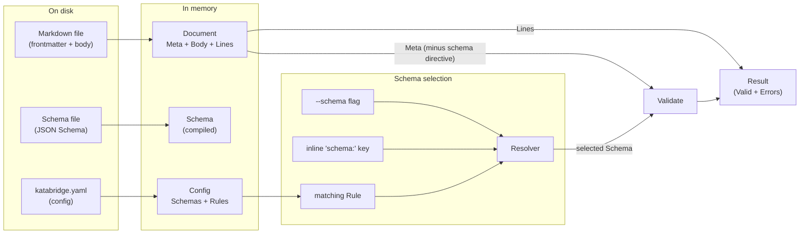

# Domain model

What `katabridge` is *about*: the concepts it manipulates, how they relate,
and which invariants hold across the system. This is the conceptual map.

For *what* the CLI does, see [`README.md`](../README.md). For *why*
specific design choices were made, see [`decisions.md`](decisions.md).
For *how the code is laid out*, see [`AGENTS.md`](../AGENTS.md).

## At a glance

## Entities

### Markdown document

The unit of work. A file on disk with two optional regions:

- A **frontmatter** block, fenced by `---` lines at the very top of the
  file. YAML in v0.x; TOML / JSON deferred to v0.5 (roadmap).
- A **body**, everything after the closing fence.

A document *may* have no frontmatter, in which case `validate` reports it
as an error (the file claimed no metadata, so we couldn't check anything).

When parsed, a markdown document becomes a `frontmatter.Document`:

| Field            | Meaning |
|------------------|---------|
| `HasFrontmatter` | Did the file open with `---`? |
| `Meta`           | Parsed YAML, normalized to `map[string]any` |
| `Body`           | Bytes after the closing fence, **never modified** except by `fmt` |
| `Lines`          | JSON-pointer-path → 1-indexed source line |

The `Lines` index is what makes error messages locatable. It accounts for
the opening `---` fence offset, so `Lines["/title"] = 2` means the
`title:` key is on line 2 of the original file.

### Schema

A JSON Schema (draft 2020-12 by default; the library supports 4 through
2020-12) describing the legal shape of a document's `Meta`.

A schema has two identities:

- A **path** on disk, where the JSON lives.
- A **name** registered in `katabridge.yaml` (e.g. `book`, `person`). The
  name is the stable public handle used by inline `schema:` directives
  and `schema show`. Paths can change; names should not.

`--schema <path>` bypasses the name layer entirely — useful for ad-hoc
runs but skips name-based identity.

In memory, schemas are `validator.Schema`: a thin wrapper around
`santhosh-tekuri/jsonschema/v6`, kept so the rest of the codebase doesn't
depend on the library directly.

### Config

The single source of truth for "what schemas exist and where they
apply." Lives at `katabridge.yaml` in the **repo root**.

Discovery walks upward from the current working directory looking for
the nearest ancestor that contains the file (cf. `.git`, `.editorconfig`,
`go.mod`). The discovered directory *is* the repo root for all
subsequent path resolution.

A `config.Config` has:

| Field     | Meaning |
|-----------|---------|
| `Root`    | Absolute, symlink-resolved repo-root directory |
| `Schemas` | Schema name → absolute file path |
| `Rules`   | Ordered list of `Rule`s (first match wins) |

Validated at load time: every `Rule.Schema` must reference a known entry
in `Schemas`.

### Rule

A `(glob, schema name)` pair. The glob is doublestar syntax (`**` works
across path segments), evaluated relative to `Config.Root`. Rules are
ordered; the first one whose glob matches a document path wins.

### Schema directive (`schema:` in frontmatter)

A per-document opt-in to a specific schema. Treated as **metadata about
katabridge itself, not user data**: the resolver reads it to choose a
schema, then strips it from `Meta` before passing to the validator. This
matters when a schema uses `additionalProperties: false` — the document
can still "name itself" without the directive becoming a validation
violation.

### Resolver

Not a persistent entity — a per-`validate`-invocation object. Owns:

1. The selection policy (which schema applies to a given path?).
2. A compiled-schema cache keyed by absolute path. The cache makes
   "validate 10,000 files against the same schema" cost one compile.

The selection policy, highest precedence first:

| # | Source                          | When it wins |
|---|---------------------------------|--------------|
| 1 | `--schema <path>` flag          | Always, for every file in the invocation |
| 2 | Inline `schema: <name>` in FM   | When (1) absent and `Meta["schema"]` is a known name |
| 3 | First matching `Rule`           | When (1) and (2) absent |
| — | None                            | Reported as an error (exit 1) |

### Validation result

The product of `(Schema, Meta)`. Two states:

- **Valid**: nothing to print except the conventional `path: OK`.
- **Invalid**: a flat list of `validator.Error`s, each with a JSON pointer
  `Path` and a `Message`. The flattening is deliberate — JSON Schema's
  raw error tree is nested (e.g. "oneOf failed → cause: pattern failed")
  and unhelpful for line-level reporting.

When combined with `Document.Lines`, an `Error` becomes a
`path:line: /pointer: message` user-visible line. If the exact pointer
has no recorded line (e.g. for "missing required property" errors), the
resolver walks up to the nearest ancestor that does — pointing at the
parent object is better than pointing at nothing.

## Lifecycle of `validate`

The data flow per file, end-to-end:

1. **Resolve config or schema flag.** If `--schema` is set, skip config
   loading. Otherwise discover `katabridge.yaml` from the working
   directory; failing to find one is a usage error (exit 2).
2. **Read file bytes.** Read errors are reported per-file but don't
   abort the run; we accumulate exit-1 status and continue.
3. **Parse frontmatter.** Errors here (malformed YAML, unterminated
   fence) are per-file failures too.
4. **Resolve schema.** Run the precedence policy above. Unmatched files
   become per-file errors.
5. **Strip the `schema:` directive** from `Meta` so user schemas with
   `additionalProperties: false` aren't tripped by katabridge's own
   metadata.
6. **Compile or fetch from cache.** Schemas live behind a path-keyed
   cache so repeated hits cost nothing.
7. **Validate.** The validator normalizes Go integer types to JSON
   `float64` before checking (yaml.v3 produces native ints; the JSON
   Schema library expects JSON-shaped numbers).
8. **Format output.** Errors get the `path:line: /pointer: message`
   treatment. Valid files print `path: OK`.

## Lifecycle of `fmt`

Much simpler. For each file:

1. Read bytes.
2. Parse to `Document`.
3. If no frontmatter, return verbatim — `fmt` never invents structure.
4. Marshal `Meta` with top-level keys sorted alphabetically, yaml.v3
   default block style.
5. Re-assemble: `---\n<sorted yaml>\n---\n<body>`. Body bytes are
   preserved verbatim; one trailing newline is enforced on the file.
6. Compare against the original. If unchanged, do nothing. Otherwise
   atomically rewrite (temp file + rename) — or, with `--check`, print
   the path and accumulate exit-1 status.

## Invariants

Properties the codebase should always uphold. Most are protected by
tests; a few are protected only by code review and convention.

1. **Body bytes are sacred.** No command except `fmt` modifies them.
   Even `fmt` only normalizes trailing whitespace and the leading
   separator; interior body bytes round-trip exactly.
2. **Schema names are stable; paths can move.** `katabridge.yaml` is
   the only place that knows how names map to paths.
3. **The `schema:` directive is katabridge metadata, not user data.**
   It influences resolution but never reaches the validator.
4. **First matching rule wins.** No "most specific match" heuristics,
   no precedence inversions. Order in `katabridge.yaml` is authoritative.
5. **Line numbers are file-relative and 1-indexed.** The opening `---`
   fence is line 1, so the first YAML key is typically line 2.
6. **Unmatched is an error, not a warning.** Silent skips hide config
   drift. Escape hatches (`--allow-unmatched`) are deferred to v0.3.
7. **Schema compilation happens once per process per absolute path.**
   The resolver's cache is the bottleneck, not the JSON Schema library.
8. **Config discovery uses symlink-resolved paths on both sides.**
   On macOS, `$TMPDIR` lives under `/var → /private/var`. Without
   `EvalSymlinks` on both root and input, `filepath.Rel` produces
   garbage and no glob ever matches.
9. **Production code lives in `internal/`.** Anything exported from
   `cmd/` or a hypothetical `pkg/` should be a deliberate choice with
   stability promises attached.

## Vocabulary

Terms to use consistently in code, docs, and user-facing copy:

| Term | Meaning |
|---|---|
| **Frontmatter** | The on-disk YAML block delimited by `---` fences. |
| **Metadata** | The parsed in-memory structure (a `map[string]any`). |
| **Schema** | A JSON Schema document. Named in config; located by path. |
| **Schema directive** | The inline `schema:` key inside a document's frontmatter. |
| **Rule** | A `(glob, schema name)` pair in `katabridge.yaml`. |
| **Repo root** | The directory containing `katabridge.yaml`. |
| **Resolver** | The runtime object that decides which schema applies to a file. |
| **Document** | A parsed markdown file with frontmatter + body + line map. |

Avoid:

- "Validator" as a *thing*. Use "schema" for what users author, and
  reserve "validator" for the runtime check itself.
- "Config" without qualification when ambiguous. Prefer
  "`katabridge.yaml`" or "the config" depending on context.

## Out of scope (today)

These are absences worth being explicit about; they shape what the
domain currently is *not*:

- **Relations between documents.** A schema can constrain one document
  at a time. No `$ref` to other documents, no foreign keys. Tracked in
  roadmap v0.6+.
- **Schema evolution.** No "this field was renamed in v2" migrations.
  Tracked in roadmap v0.4.
- **Query.** No "find all docs where year > 1980." Tracked in v0.4.
- **Derived state.** No index, no cache file, no `.katabridge/`
  directory. Every run is stateless.
