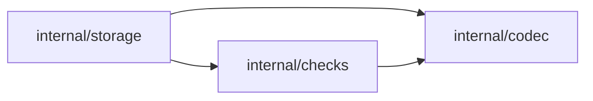

# Spec — codec layer

> **Status: planning.** Introduces `internal/codec/` as the shared home for
> item content codecs, starting with the current markdown/frontmatter document
> codec.

## Overview

Katalyst needs a codec layer: packages that turn stored bytes or records into
the content shape checks, fix, inspect, and storage readers consume. The current
markdown/frontmatter codec lives under `internal/storage/collection/document`,
but it is already shared outside storage. Move it to a top-level internal codec
home and rename it for the content shape it handles.

## Value

The package graph should say what the code means. Checks should not import a
package under `internal/storage` just to parse markdown body text, and future
codecs should not pretend to be collection storage implementations.

This change removes the collapsed `storage <-> checks` dependency cycle without
moving check configuration or changing storage behavior.

## Current State

The current codec lives in `internal/storage/collection/document`. It contains:

- `Document`, the parsed markdown content shape: frontmatter metadata, raw
  frontmatter bytes, body bytes, body line, source line map, and format.
- `Kind`, the YAML/TOML/JSON frontmatter format enum.
- `Parse`, which parses markdown files with YAML `---`, TOML `+++`, or leading
  JSON frontmatter.
- `Encode`, which writes canonical frontmatter and preserves the body.
- sentinel parse errors such as `ErrInvalidYAML`, `ErrInvalidTOML`, and
  `ErrInvalidJSON`.

The package has no internal imports. It does not depend on storage, collection
identity, filesystem paths, backend references, or checks. It is a leaf codec.

Consumers already treat it as shared infrastructure:

- `internal/checks` stores `*document.Document` in `checks.Context`.
- `internal/checks/checktest` parses documents for check-family tests.
- `internal/fix` parses and re-encodes documents.
- `internal/inspect` parses documents for source and collection views.
- `cmd/item.go` and `cmd/write_validation.go` parse item files.

At the Go package level there is no import cycle. At the collapsed architecture
level, though, `checks` imports a package whose path is under `storage`, while
`storage/collection` imports `checks` for configured checks:


The concrete edges are:

```text
internal/storage/collection -> internal/checks
internal/checks -> internal/storage/collection/document
```

The existing `product/specs/collection-reorg-spec.md` placed the codec under
`storage/collection` because parsing markdown was part of the collection read
path. That was coherent when the main question was "where does collection read
logic live?" The dependency map now shows a second concern: codecs are shared
content adapters, not storage implementations.

## Design

Add a top-level codec layer:

```text
internal/
  codec/
    markdownbodytext/
      parse.go
      encode.go
      doc.go

  storage/
    collection/
      collection.go
      parse.go
      query/
      filesystem/

  checks/
  fix/
  inspect/
  project/
```

`internal/codec` is the home for item content codecs. A codec translates a
storage unit's content into a reusable in-memory shape, and may translate that
shape back to bytes when the content format supports writing.

`internal/codec/markdownbodytext` is the first codec. It is the current
`internal/storage/collection/document` package moved and renamed. Its exported
API remains behavior-compatible:

- `Document`
- `Kind`
- `KindYAML`, `KindTOML`, `KindJSON`
- `Parse`
- `Encode`
- parse sentinel errors

The package name should be `markdownbodytext` to match Go package naming. In
docs and prose, call it the **markdown body text codec**.

### Dependency Shape

After the move, the collapsed dependency graph becomes:



`storage -> checks` remains because `collection.Collection` carries configured
checks. This spec does not change that. The important change is that `checks`
no longer imports `storage`.

The real production edges become easier to explain:

- storage readers use codecs to decode stored content.
- checks use codecs' in-memory shapes to validate content.
- fix uses codecs to parse and encode content.
- inspect uses codecs to parse content for evidence.

No codec imports storage, checks, project, fix, inspect, or cmd.

### Naming

Use `codec`, not `content`, `format`, or `document`.

- `codec` names the role: encode/decode between stored representation and an
  in-memory shape.
- `content` is too broad; checks and inspectors also handle content.
- `format` is too narrow; future codecs may decode row sets or API payloads,
  not just file formats.
- `document` describes the current Go type, not the package's role.

Use `markdownbodytext`, not `document`, for the first codec.

The current package parses markdown body text plus structured frontmatter. The
name aligns with the existing check family `internal/checks/markdownbodytext`
and avoids claiming the generic word "document" for one content shape.

### Future Codecs

The layer leaves room for future content adapters:

```text
internal/codec/
  markdownbodytext/
  csvrows/
  jsonlines/
  htmlpages/
```

These names are examples, not commitments. Add a codec only when a second
storage backend or operation needs a reusable content adapter.

Backend readers still live under storage:

```text
internal/storage/collection/
  filesystem/
  sqlite/
```

The division is:

- `internal/storage`: where items live and how collection identity maps to
  backend references.
- `internal/codec`: how bytes, rows, or payloads become item content.
- `internal/checks`: what conditions validated content must satisfy.

### Migration

Move the current package:

```text
internal/storage/collection/document
  -> internal/codec/markdownbodytext
```

Then update imports and local names. Two local naming styles are acceptable:

```go
import "github.com/abegong/katalyst/internal/codec/markdownbodytext"
```

or, when the surrounding code is clearer with a shorter qualifier:

```go
import document "github.com/abegong/katalyst/internal/codec/markdownbodytext"
```

Prefer the full `markdownbodytext` qualifier in newly touched code. Use the
`document` alias only to keep a mechanical move small where the code is built
around `document.Document`.

Update package comments to describe the codec role, not storage placement.

## Decisions

1. **Rename all local qualifiers to `markdownbodytext`.**

   The old package qualifier was `document`. A pure path move could alias the
   new package as `document` and keep most call sites unchanged, but this change
   is meant to make the architecture read correctly. Use
   `markdownbodytext.Parse`, `markdownbodytext.Document`, and similar names in
   the implementation.

2. **Do not add a shared `internal/codec` interface yet.**

   A codec layer may eventually have common interfaces, but the current markdown
   codec exposes concrete functions and types. One codec is not enough evidence
   for a useful shared contract, so let a second codec force the common shape.

## Documentation Updates

- `internal/codec/markdownbodytext/doc.go`: describe the markdown body text
  codec and its parse/encode contract.
- `internal/storage/collection/AGENTS.md`: remove the statement that `document`
  lives under collection; point readers to `internal/codec/markdownbodytext`.
- `internal/checks/AGENTS.md`: note that check contexts use codec-owned content
  shapes.
- `docs/content/deep-dives/domain-model/frontmatter.md` and
  `docs/content/deep-dives/domain-model/fix.md`: update package references from
  `internal/storage/collection/document` to `internal/codec/markdownbodytext`.
- `docs/content/deep-dives/domain-model/storage.md`: mention that storage readers use codecs
  for content decoding, but codecs are not storage backends.
- `docs/content/deep-dives/domain-model/collections.md`: update any reference that treats the
  markdown codec as a collection subpackage.
- `product/specs/collection-reorg-spec.md`: add a short supersession note or
  leave it as historical context and reference this spec from the implementation
  plan.
- `docs/content/reference/glossary.md`: add or update a codec entry only if the
  term becomes part of public developer docs.

User-facing CLI docs do not change.

## Test Checklist

- [ ] `go test ./...` passes.
- [ ] No production import path contains `internal/storage/collection/document`.
- [ ] `internal/checks` imports `internal/codec/markdownbodytext`, not any
      package under `internal/storage`.
- [ ] The collapsed dependency graph no longer contains `checks -> storage`.
- [ ] Markdown parse and encode tests move with the package and keep their
      current coverage.
- [ ] `fix` output remains byte-identical for canonical frontmatter cases.

## Rejected Alternatives

- **Keep the codec under `storage/collection` and document it as a leaf.** This
  preserves the collection-read story, but it does not fix the misleading
  collapsed dependency graph. Checks still appear to depend on storage.
- **Move the package to `internal/document`.** This removes the dependency smell,
  but it gives one content shape the generic name. Future codecs would not have
  an obvious peer home.
- **Create `internal/content/markdownbodytext`.** `content` names the domain but
  not the operation. The package's job is encode/decode, so `codec` is more
  precise.
- **Introduce a generic codec interface now.** There is one codec today. A shared
  interface would be guessed rather than extracted.
