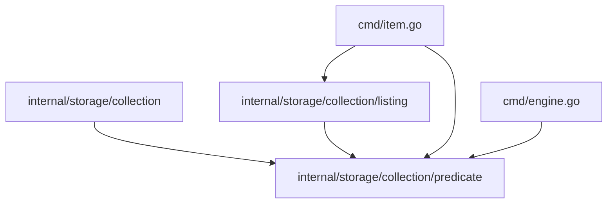

# Spec — listing and predicates

> **Status: planning.** Splits the overloaded `query` package into listing
> behavior, reusable metadata predicates, and list-default configuration.

## Overview

The current `internal/storage/collection/query` package uses one name for three
concepts: the `item list` pipeline, the metadata predicate grammar, and
configuration defaults for filtering and sorting. Split those concepts so
variants, item listing, and config each name what they actually use, including a
config key rename from `query:` to `listing:`.

## Value

Clear names make the domain model easier to extend. A future first-class query
operation should not inherit today's overloaded package name, and collection
variants should not appear to depend on item listing just because they reuse the
same predicate grammar.

## Current State

`internal/storage/collection/query` contains:

- `Record`, `Options`, `Region`, and `Apply` in `query.go`, which implement the
  in-memory `item list` pipeline: filter, grep, sort, skip, limit.
- `Predicate`, `ParseFilter`, and `Predicate.Matches` in `filter.go`, which
  parse and evaluate metadata conditions such as `year>=1965` and
  `kind=section`.
- `SortKey` and `ParseSort` in `sort.go`, which parse sort keys for item
  listing.

The package has two different consumers:

- `cmd/item.go` builds `query.Options`, creates `query.Record` values, parses
  `--filter` and `--sort`, and calls `query.Apply` for `item list`.
- `internal/storage/collection/parse.go` parses collection variant `when`
  expressions through `query.ParseFilter`, storing `[]query.Predicate` on
  `CollectionVariant`.
- `cmd/engine.go` evaluates those variant predicates with
  `Predicate.Matches`.

The config name adds a third meaning. Project and collection config use a
`query:` block, but that block does not define a query. It sets defaults for
two listing behaviors:

```yaml
query:
  filterTypeMismatch: skip
  sortMissing: last
```

`filterTypeMismatch` applies when `item list --filter` compares incompatible
types. For example, `--filter year>=1965` against `year: "unknown"` cannot be
ordered numerically. `skip` treats the item as a non-match. `error` exits with a
usage error.

`sortMissing` applies when `item list --sort` sorts on a key that some items do
not have. `last` puts missing values at the end for both ascending and
descending sorts. `lowest` treats missing values as lower than any present
value, then applies the requested sort direction.

These values resolve by precedence: CLI flag, collection `query:`, project
`query:`, built-in default. The flags are `--on-type-mismatch` and
`--sort-missing`.

The target spelling is `listing:`:

```yaml
listing:
  filterTypeMismatch: skip
  sortMissing: last
```

The docs already mark the term as unresolved. `product/specs/domain-model-
terminology-matrix.md` says "Query" contradicts itself: core concepts list it as
a supported operation, the domain model lists it as out of scope, and
`internal/storage/collection/query` exists anyway.

GitHub issue #76 tracks the same contradiction. It asks whether today's
single-collection `item list --filter`/`--sort` behavior is "query," or whether
it is a listing convenience distinct from a future query operation. This spec
chooses the second answer: the shipped behavior is listing and predicates; Query
remains the name for a future operation that asks storage for matching items.

## Design

Replace `query` with two packages:

```text
internal/storage/collection/
  listing/
    listing.go   // Record, Options, Region, Apply
    sort.go      // SortKey, ParseSort

  predicate/
    predicate.go // Predicate, Parse, Matches, TypeMismatchError
```

`predicate` is the reusable primitive. It parses one metadata condition and
evaluates it against `map[string]any`. Both listing filters and collection
variant discriminators use it.

`listing` is the `item list` in-memory operation. It filters and greps records,
sorts them, then applies skip and limit. It imports `predicate` for filter
evaluation.

The resulting dependency shape is:



### Predicate Package

`predicate` owns the grammar currently called `--filter`:

```go
package predicate

type Predicate struct { ... }
type TypeMismatchError struct { Field string }

func Parse(expr string) (Predicate, error)
func (p Predicate) Matches(meta map[string]any, typeMismatch string) (bool, error)
```

Use `predicate.Parse`, not `ParseFilter`, because not every predicate is a list
filter. The grammar stays the same:

- `field=value`
- `field!=value`
- `field>value`, `field>=value`, `field<value`, `field<=value`
- `field=~regex`
- `field=a,b` and `field!=a,b`
- `field` for existence
- `!field` for absence

The implementation keeps YAML scalar decoding for right-hand-side values so CLI
filters and variant discriminators keep their current type behavior.

### Listing Package

`listing` owns the in-memory `item list` pipeline:

```go
package listing

type Region int
type Record struct { ... }
type Options struct {
    Filters []predicate.Predicate
    Greps []*regexp.Regexp
    GrepIn Region
    Sorts []SortKey
    Skip int
    Limit int
    TypeMismatch string
    SortMissing string
}

func ParseSort(spec string) ([]SortKey, error)
func Apply(records []Record, opts Options) ([]Record, error)
```

Keep sort parsing in `listing`, not `predicate`. Sort is part of the listing
pipeline, and variants do not sort.

### Config Defaults

Rename internal config structs away from query. The structs represent resolved
defaults for the `item list` pipeline, not an executable query:

```go
type ListingDefaults struct {
    FilterTypeMismatch string
    SortMissing        string
}

type RawListingDefaults struct {
    FilterTypeMismatch string `yaml:"filterTypeMismatch"`
    SortMissing        string `yaml:"sortMissing"`
}
```

The YAML key becomes `listing:`:

```go
type rawConfig struct {
    Listing *collection.RawListingDefaults `yaml:"listing"`
}
```

The old `query:` key should be rejected with a targeted error that tells the
user to rename it to `listing:`. This keeps the config contract explicit instead
of supporting two names for the same concept.

For `Collection`, replace:

```go
Query QuerySettings
```

with:

```go
ListingDefaults ListingDefaults
```

Callers then read `c.ListingDefaults.FilterTypeMismatch` and
`c.ListingDefaults.SortMissing`.

### Documentation Language

Use these terms consistently:

- **Predicate**: one metadata condition, used by `item list --filter` and
  variant `when`.
- **Listing**: the `item list` pipeline over in-memory records.
- **Listing defaults**: config-backed defaults for listing behavior.
- **Query**: reserved for a future first-class operation that can ask storage for
  matching items directly.

User-facing CLI flags keep their names. `item list --filter` remains
`--filter`, not `--predicate`.

The `listing:` config key replaces `query:`. Docs should describe this as an
intentional config rename, not a synonym.

This resolves #76 by making the shipped subset explicit without calling it
Query. Katalyst currently has single-collection listing filters and sort keys.
It does not have a dedicated query verb, cross-collection query, storage-pushed
query planning, joins, or aggregation.

## Open Questions

_None._

Resolved:

- The YAML key changes from `query:` to `listing:`.
- The resolved collection field/type uses `ListingDefaults`.
- `predicate` stays under `internal/storage/collection`. It is a
  collection-level primitive used by collection variants and item listing.
  Promote it only when a non-collection subsystem needs it.

## Documentation Updates

- `internal/storage/collection/AGENTS.md`: replace `query` guidance with
  `predicate`, `listing`, and list-default terminology.
- Package docs for `internal/storage/collection/predicate`: define the grammar
  and its two consumers.
- Package docs for `internal/storage/collection/listing`: define the in-memory
  item-list pipeline.
- `docs/content/reference/configuration.md`: rename the `query:` section to
  `listing:` and document the config migration.
- `docs/content/deep-dives/domain-model/collections.md`: update variants to say they use the
  metadata predicate grammar, not the query package.
- `docs/content/deep-dives/domain-model/_index.md`: replace the current "Query" out-of-
  scope note with a precise distinction: listing filters are shipped; a
  first-class Query operation is planned.
- `docs/content/deep-dives/domain-model/_index.md`: mark **Query** as a planned
  operation, not a currently shipped one.
- GitHub issue #76: close once the docs and code use the new terminology.
- `product/specs/domain-model-terminology-matrix.md`: update the Query/filter
  row after the rename lands.

User-facing command docs keep `item list --filter` and `item list --sort`.

## Test Checklist

- [ ] `go test ./...` passes.
- [ ] No production import path contains `internal/storage/collection/query`.
- [ ] Variant parsing uses `predicate.Parse`.
- [ ] Variant routing uses `Predicate.Matches`.
- [ ] `item list` uses `listing.Apply`.
- [ ] Existing filter grammar tests move to `predicate`.
- [ ] Existing sort and pipeline tests move to `listing`.
- [ ] Project and collection config tests cover project defaults, collection
      overrides, and flag precedence for `listing:`.
- [ ] Old `query:` config fails with a targeted error that points to `listing:`.

## Rejected Alternatives

- **Keep `query` and improve comments.** Comments would help readers, but the
  package name would still conflate listing, predicates, and config defaults.
- **Rename the package to `filter`.** Filtering is only one stage of listing,
  and predicates also drive variants.
- **Move everything to `listing`.** Variants would still appear to depend on the
  item-list operation, which is the current confusion in a new package.
- **Rename the user-facing `--filter` flag to `--predicate`.** The CLI term
  `filter` is familiar. The internal reusable object can be called a predicate
  without changing the flag.
